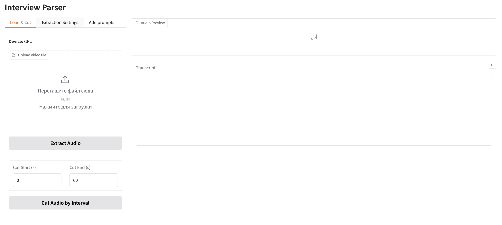

<div align="center">
  
  <p><em>Interview Parser is an application for transcribing and analyzing interview videos via a convenient Gradio web interface</em></p>
</div>


## Main Features
- Upload interview video files
- Extract audio track from video
- Trim audio to the desired interval
- Transcribe audio to text (Whisper)
- Speaker diarization (requires HuggingFace token)
- Select the number of speakers
- Choose transcription language
- CUDA support (if available)
- Add prompts to extract questions, summaries, or other custom tasks

## Quick Start

1. Create and activate a conda environment:
   ```bash
   conda create -n interview_parser python=3.10
   conda activate interview_parser
   ```
2. Install dependencies:
   ```bash
   pip install -r requirements.txt
   ```
3. Make sure ffmpeg is installed as a system package.
4. Launch the application:
   ```bash
   python code/app.py
   ```
5. Open the link from the console (usually http://127.0.0.1:7860) in your browser.

## How to Use
1. Upload your interview video file.
2. Get the audio transcription as text.

**Optional features:**
- Trim the audio file by time if needed.
- For speaker diarization, you will need a HuggingFace token (see below).
- Add prompts to extract questions, summaries, or other tasks — select a prompt or add your own.
- Select the number of speakers and language if required.
- If you have CUDA, the app will automatically use it for faster processing.

## HuggingFace Token for Speaker Diarization
The speaker diarization feature uses the `pyannote/speaker-diarization-3.1` model, which requires a HuggingFace access token.

1. Register or log in at https://huggingface.co
2. Go to your account settings → Access Tokens: https://huggingface.co/settings/tokens
3. Create a new token (read access is enough)
4. Paste the token into the corresponding field in the app interface when prompted for diarization

## Requirements
- Python 3.10+
- ffmpeg (install as a system package)

## Notes
- Whisper and pyannote models are downloaded automatically on first run.
- CUDA is used automatically if available.
